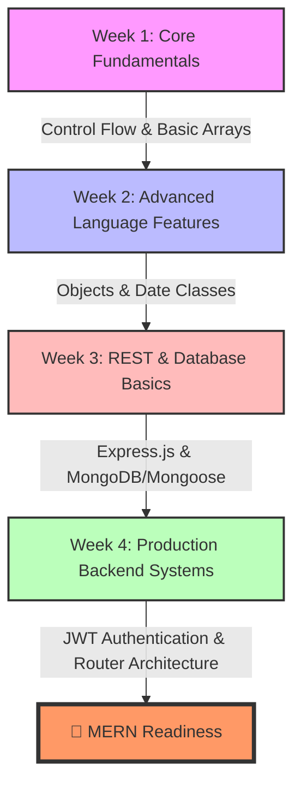

# JavaScript & Backend Engineering Assignments 💻

This directory is the central hub for the core JavaScript assignments, REST APIs, and backend server engineering tasks. Each week is organized to systematically scale complexity: starting from raw language operations to custom module architectures, Express servers, Mongoose schema validation, and secure authentication models.

---

## 🗺️ Curriculum Roadmap



---

## 📂 Structural Tree

```
JS-ASSIGNMENTS/
├── 📂 week-1/               # Core Syntax, Arrays & Objects
│   ├── arrayAdvOperations/  # Map, Filter, Reduce, Find
│   ├── arrayOperations/     # Stack, course lists, temp ranges
│   ├── controlStatements/   # Login validations, billing
│   ├── objectOperations/    # Object models, dynamic modifications
│   └── operators/           # Fundamental operators
│
├── 📂 week-2/               # Advanced Reference Types & Domain Models
│   ├── copytypes/           # Deep vs Shallow cloning mechanics
│   ├── DateOperations/      # Validation & difference engines
│   ├── Ecommerce/           # Shopping cart core modules
│   ├── OnlineLearningPlatform/ # RBAC system, user profiles
│   └── ToDo/                # Modular tasks organizer (ESM format)
│
├── 📂 week-3/               # Database-backed REST API Servers
│   ├── BackendDemo/         # Express API with memory structures
│   ├── BackendDemoUsingDB/   # Express + Mongoose (Users, Products)
│   └── MongoDB-Commands/    # Document update query playbook
│
└── 📂 week-4/               # Security & Relational Models
    ├── Backend/             # JWT, Password Encryption, Route Guards
    └── Basic-Ecommerce/     # Product catalogs & DB schemas
```

---

## ⚡ Quick Weekly Overview

### 🗓️ [Week 1: Core Fundamentals](week-1/)
Getting comfortable with basic syntax structures, arithmetic computations, functional array mapping, filtering, reducing, and working with complex in-memory objects.

### 🗓️ [Week 2: Reference Types & Date Handling](week-2/)
Focuses on JS reference sharing, deep/shallow object copies, operations with the native JavaScript `Date` API, and standard modular architecture (using ESM exports/imports) in building a ToDo organizer.

### 🗓️ [Week 3: Express & MongoDB REST Servers](week-3/)
Transitioning into backend architecture. Includes designing endpoints with Express, setting up in-memory CRUD systems, configuring MongoDB databases, writing raw Shell commands, and structuring object-document maps (ODM) via Mongoose.

### 🗓️ [Week 4: Enterprise Backends, JWT Auth & Relational Schemas](week-4/)
Introducing security layers. Includes setting up password hashing with `bcryptjs`, generating secure access tokens with `jsonwebtoken` (JWT), creating token verification middleware, and setting up clean Express Router structures for multi-controller systems.

---

## ⚙️ Running any file
Since the early assignments are pure JS files, you can execute them directly in your shell:
```bash
# Example: Running the student array operation from week-1
node JS-ASSIGNMENTS/week-1/arrayOperations/student.js

# Example: Running the shallow copy demo from week-2
node JS-ASSIGNMENTS/week-2/copytypes/ShallowCopyTask.js
```

For Weeks 3 & 4, be sure to `npm install` inside the folder before running.
