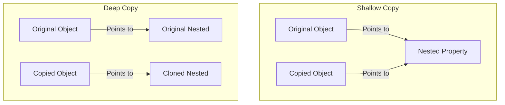

# Week 2: Advanced Reference Types, Dates & Modular Architectures ⚙️

This week focuses on reference copying mechanics, JavaScript Date management, and modern ESM (ES Module) systems. The assignments simulate production modules, demonstrating how to isolate business logic, write reusable utilities, and build domain-driven architectures.

---

## 📂 Folder Roadmap

| Subdirectory | Core Objective | Key Files |
| :--- | :--- | :--- |
| **`copytypes`** | Isolation mechanics (Shallow vs Deep object copying) | `ShallowCopyTask.js`, `DeepCopyTask.js` |
| **`DateOperations`** | Dynamic date calculations, validation, and age calculators | `dateCreation.js`, `AgeCalculator.js`, `dateValidation.js` |
| **`ToDo`** | ESM-based Command Line Task Organizer with state validation | `task.js`, `validator.js`, `app.js` |
| **`Ecommerce`** | Modular shopping backend (Products, Cart, Coupons, Payment) | `product.js`, `cart.js`, `discount.js`, `payment.js`, `app.js` |
| **`OnlineLearningPlatform`** | Admin dashboards, active course catalogs, role filters | `roles.js`, `data.js`, `courses.js`, `cart.js`, `UserProcesEngine.js` |

---

## 💡 Conceptual Spotlights

### 🧠 1. Deep Copying vs. Shallow Copying

JavaScript handles primitive values (number, string, boolean) by value, but objects and arrays are handled **by reference**. This creates potential bugs when copy operations are performed incorrectly.



#### ⚠️ The Shallow Copy Issue (`ShallowCopyTask.js`):
Using the spread operator `{...user}` creates a shallow copy. The top-level properties are cloned, but nested properties (like `user.preferences`) still reference the original memory location!
```javascript
let copyUser = { ...user };
copyUser.preferences.theme = "light"; // Modifies BOTH the original AND the copy!
```

#### 🛡️ Achieving a True Deep Copy (`DeepCopyTask.js`):
To prevent shared reference bugs, we must fully isolate nested layers. A standard in-built way to clone objects deeply in JavaScript is:
```javascript
// Method A: JSON Serialization (Standard)
let deepCopy = JSON.parse(JSON.stringify(order));

// Method B: Modern native structuredClone (Node.js 17+)
let deepCopy = structuredClone(order);
```

---

### 📆 2. Date Object Lifecycles (`DateOperations`)
JavaScript's `Date` class maps epochs, calculates differences, and formats times.
* **`dateCreation.js`**: Standard timestamp generation and manual pad formatting (`DD-MM-YYYY HH:mm:ss`).
* **`AgeCalculator.js`**: Date differential logic mapping years and validation metrics between two distinct Epoch times.
* **`dateValidation.js`**: Identifies whether dynamic inputs match true calendar structures, excluding imaginary dates.

---

### 📦 3. Domain-Driven Modular Architectures

#### 📝 A. Modular ToDo System (`ToDo`)
Demonstrates cleaner state mutations using helper functions and modular separation:
* `validator.js`: Validates input length and restricts past-due dateline limits.
* `task.js`: Contains in-memory state arrays with custom task operations (`addTask`, `getAllTasks`, `completeTask`).
* `app.js`: Main testing orchestration script using modern ES Modules.

#### 🛒 B. E-Commerce Core Systems (`Ecommerce`)
Isolates complex business workflows into individual domain modules:
* `product.js`: Houses catalogs and filter engines.
* `cart.js`: Computes basket weight, items, and tax ratios.
* `discount.js`: Validates static coupons (`WELCOME10` or `SAVE20`).
* `payment.js`: Verifies transactions based on payment channels (`card`, `upi`).

#### 🎓 C. Role-Based Learning Engine (`OnlineLearningPlatform`)
Manages registration records using filtering:
* `roles.js` & `data.js`: Establish standard schemas.
* `UserProcesEngine.js`: Exercises safe state changes by cloning elements immutably via `{ ...user, active: false }` during status updates.

---

## ⚡ Running Locally

These files utilize modern ES Module (`import`/`export`) syntax. To execute them successfully, ensure a top-level `package.json` with `"type": "module"` is configured, or run using Node.js:

```bash
# E.g. running the E-commerce module
node JS-ASSIGNMENTS/week-2/Ecommerce/app.js

# E.g. running deep copy analysis
node JS-ASSIGNMENTS/week-2/copytypes/DeepCopyTask.js
```
