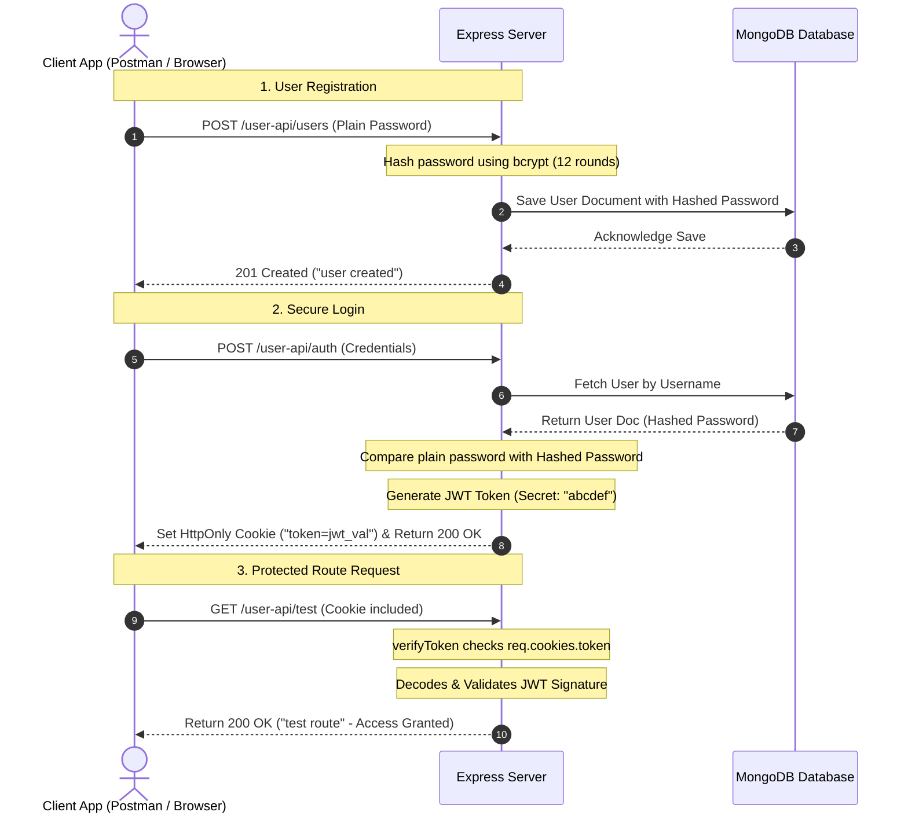

# Week 4: Security, Authentication & Advanced Schemas 🔐

This week focuses on building secure, production-grade backend servers. The main core concepts are web security, password hashing, token-based authentication (JSON Web Tokens), cookies-based session storage, and relational validation schemas using MongoDB and Mongoose.

---

## 📂 Folder Roadmap

| Subdirectory | Core Objective | Key Files |
| :--- | :--- | :--- |
| **`Backend`** | Express Server with secure JWT cookie login & route guards | `server.js`, `middlewares/verifyToken.js`, `APIs/UserApi.js` |
| **`Basic-Ecommerce`** | E-commerce core catalog API linked to specialized DB schemas | `server.js`, `models/productModel.js`, `APIs/ProductApi.js` |

---

## 💡 Authentication Architecture & Flow



---

## 🛠️ Security Core Implementations

### 1. Cryptographic Password Hashing (`bcryptjs`)
Storing passwords in plain text is a significant security risk. We use **bcryptjs** to execute slow-hashing algorithms with 12 salt rounds, ensuring database breaches do not compromise user credentials.
```javascript
import { hash, compare } from "bcryptjs";

// Hashing on user creation:
let hashedPassword = await hash(req.body.password, 12);
newUser.password = hashedPassword;

// Verification on login:
let isMatch = await compare(userCred.password, userOfDB.password);
```

### 2. State-free Session Tokens (`jsonwebtoken`)
To identify authenticated users without saving sessions in server memory, we issue a JSON Web Token containing the user's metadata, cryptographically signed with a private secret.
```javascript
import jwt from "jsonwebtoken";

let signedToken = jwt.sign(
  { username: userCred.username }, 
  "abcdef", 
  { expiresIn: 30 } // Short-lived security token
);
```

### 3. Secure Cookie Delivery (`HttpOnly`)
Instead of saving sensitive tokens in `localStorage` (which is vulnerable to XSS attacks), the server pushes the token directly to the browser's storage using a secure cookie header.
```javascript
res.cookie("token", signedToken, {
  httpOnly: true, // Prevents Javascript client-side read access
  secure: false,  // Set to true in production over HTTPS
  sameSite: "lax", // Protects against CSRF attacks
});
```

### 4. Custom Auth Middleware Route Guards (`verifyToken.js`)
Endpoints are locked using a custom interceptor middleware that parses the cookie, verifies the token's validity, and handles access control:
```javascript
export function verifyToken(req, res, next) {
  let singleToken = req.cookies.token;
  if (!singleToken) {
    return res.status(401).json({ message: "please login first" });
  }
  try {
    let decodedToken = jwt.verify(singleToken, "abcdef");
    req.currentUser = decodedToken;
    next(); // Access approved, proceed to route handler
  } catch (err) {
    return res.status(403).json({ message: "Invalid or expired token" });
  }
}
```

---

## ⚡ API Testing & Setup

### Running Backend (Port 5000)
1. Install dependencies (requires `bcryptjs`, `jsonwebtoken`, `cookie-parser`, `express`, `mongoose`):
   ```bash
   cd JS-ASSIGNMENTS/week-4/Backend
   npm install
   ```
2. Run the secure server:
   ```bash
   node server.js
   ```

### Running Basic-Ecommerce (Port 5000)
1. Navigate and install dependencies:
   ```bash
   cd JS-ASSIGNMENTS/week-4/Basic-Ecommerce
   npm install
   ```
2. Launch database-driven server:
   ```bash
   node server.js
   ```

### Example Test Requests (`userTest.http`)
```http
### Register a secure User
POST http://localhost:5000/user-api/users
Content-Type: application/json

{
  "username": "jeshwanth",
  "password": "SuperSecretPassword123",
  "email": "jeshwanth@mern.dev"
}

### Authenticate and Retrieve Cookie
POST http://localhost:5000/user-api/auth
Content-Type: application/json

{
  "username": "jeshwanth",
  "password": "SuperSecretPassword123"
}
```
